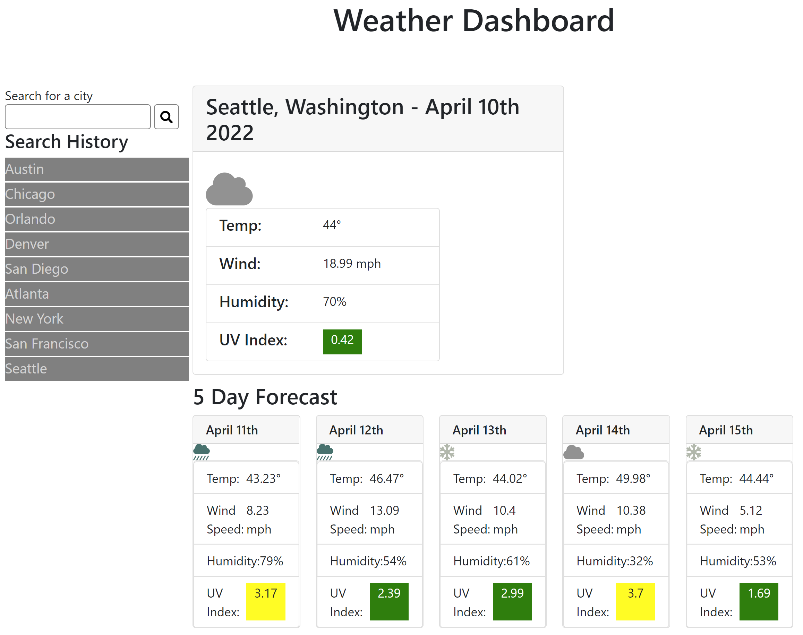

# Project Title
Weather-board

## Description:
A weather dashboard that will run in the browser and feature dynamically updated HTML and CSS. Users will be able to see the weather outlook for different cities. 

## Usage
Use the application to see the weather outlook for different cities.

## User Story
```
As a traveler
I want to see the weather outlook for multiple cities
So that I can plan my trip accordingly
```

## Technologies
* JavaScript
* HTML
* CSS
* Moment.js
* OpenWeather One Call API

## Screenshot



## License [](https://opensource.org/licenses/MIT)